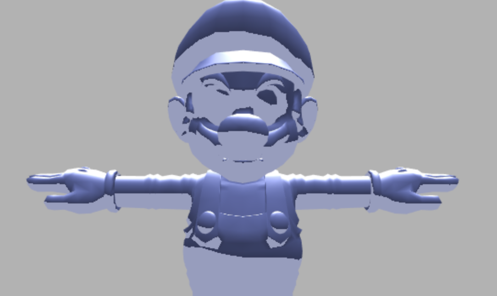
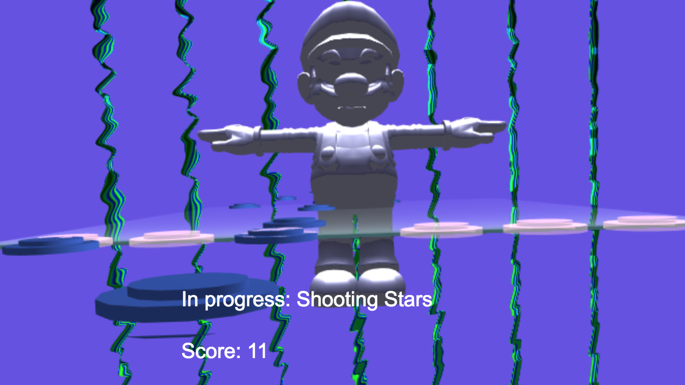
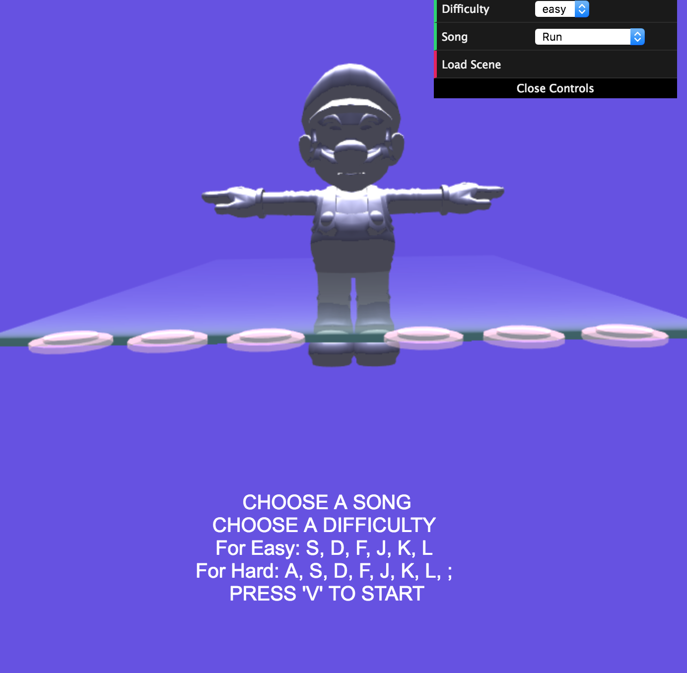

#MILESTONE UPDATE
Instead of working with pure midi/mp3 files, since they don't have big/useable libraries/API, I tried multiple npm libraries, none worked.
I just converted MIDI files to JSON files with Tone.js's MIDIConvert. The resources folder has all the json and mp3 that are needed.

With these json files, which is done in main.ts, I worked on the easy mode
From 15 - 40, letter A
From 40 - 52, letter S
From 52 - 64, letter D
From 64 - 76, letter J
From 76 - 88, letter K
From 88 - 120, letter L

These will have to be more randomized

A button obj has letter, time mark, duration 
The letter is the key that should be pressed. 
Time Mark marks when the key comes up
Duration is for how long the key lasts.

I have to work on creating the layout of the buttons into a big mesh so that it can proceed as the program runs.

Mario is in the background like a monument, the metal shader is referenced from Alexis' Metal Shader.

demo link: https://sangeun44.github.io/Rhythm_Visualizer_Game/

# Final Procedural Project  
# Music Visualizer - BTS Super Star/Guitar Hero 

# WRITE UP
* Pennkey: eunsang
* Name: Sang Lee
* demo: https://sangeun44.github.io/Rhythm_Visualizer_Game/

# Summary 
This project is an experiment to recreat BTS Super Star by Dalcomm Soft and takes inspiration from Guitar Hero.

Design Document: https://docs.google.com/document/d/1Lr6PYYaQb-z2wbhG3Rc8ZG_MI8Hfo2A5I6ClWHpsIXM/edit?usp=sharing

## Music Reader
User can choose a song to play from the menu

The program reads in a json file representation of the midi and analyzes the frequency and beats to create a sequence of keys to press.

## User Interface
The player can choose between two difficulties: Easy & Hard

Easy Mode: This mode only uses 6 keys on the keyboard. S, D, F, J, K, L

Hard Mode: This mode only uses 8 keys on the keyboard. A, S, D, F, J, K, L, ;

## Start
The user chooses a difficulty mode and a song.

The game starts. The program reads through the sequences of keys created beforehand. 

Buttons to smash will show on the screen like guitar hero. 

The buttons will move towards you. 

The buttons are all in one Mesh. This Mesh moves as time goes by in the shader

The user has to tap the correct key at the correct time. 

## Visulization Decoration
* buttons - will be transparent unless pressed, will have a special effect when pressed
The background moves according to the music.

It might be a bit distracting

I created a Mesh with a lot of tessellation and after getting the bpm and the amplitude of the song, it morphs the mesh accordingly. 
Using a noise function the tessellated polygons were deformed.

## OBJ loading
[webgl-obj-loader](https://www.npmjs.com/package/webgl-obj-loader)

1) Loaded Button Objects
2) Visulization models (sphere, cube)

## Sources
Grace Xu Final Music Visualizer:  https://github.com/gracexu94/FinalProject
* Web Audio API
* Tone.js
* Node.js 
* P5.js
* web-audio-beat-detector

Audio Vis : https://github.com/willianjusten/awesome-audio-visualization

